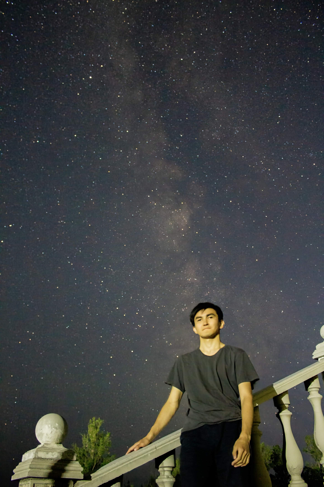

## About Me

Hi! I'm Maksat, an upcoming PhD student at Norwegian University of Science and Technology (NTNU).

During my MS and BS at Moscow Institute of Physics and Technology and Space Research Institute (IKI) I worked on transient X-ray sources such as Supergiant Fast X-ray Transients (SFXTs), Supergiant X-ray Binaries (SgXBs) and X-ray bursters.

High Energy Astrophysics Today and Tomorrow conference poster ([eng](heaconf2022_poster_eng.pdf), [rus](heaconf2022_poster_ru.pdf)).

<!-- This is a jekyll based resume template. You can find the full source code on [GitHub](https://github.com/bk2dcradle/researcher)

## Research Interest

Lorem ipsum dolor sit amet, consectetur adipiscing elit. Aliquam finibus ipsum ac erat aliquam dapibus. Vestibulum vehicula placerat ex, a consectetur odio pharetra quis. Mauris id urna ante. Fusce pharetra diam ac nisi aliquet, vel egestas ex iaculis. Pellentesque laoreet cursus tellus sed pellentesque. Praesent a rhoncus elit. Nunc ipsum nisl, consequat sit amet pretium quis, gravida id ipsum.

## Publications

1. F.Bar, J.Doe: Effects of having a placeholder of a name
2. S.Holmes, J.Watson: Consequences of living with a sociopath in London

## Typography

This is a [link](http://google.com). Something *italics* and something **bold**.

Here is a table

| Year | Award     | Category                                              |
| ---- | --------- | ----------------------------------------------------- |
| 2014 | Emmy      | Won Outstanding Lead Actor in a miniseries or a movie |
| 2015 | BAFTA     | Nominated for Best Leading Actor for Sherlock         |
| 2014 | Satellite | Won Best Actor miniseries or television film          |

Here is a horizontal rule

---

Here is a blockquote

> To a great mind, nothing is little

## References

* Foo Bar: Head of Department, Placeholder Names, Lorem
* John Doe: Associate Professor, Department of Computer Science, Ipsum -->
